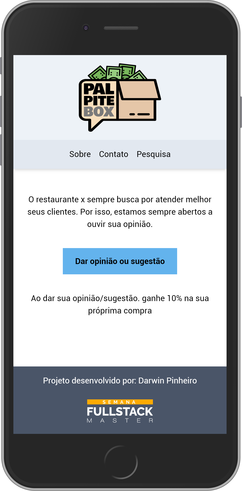
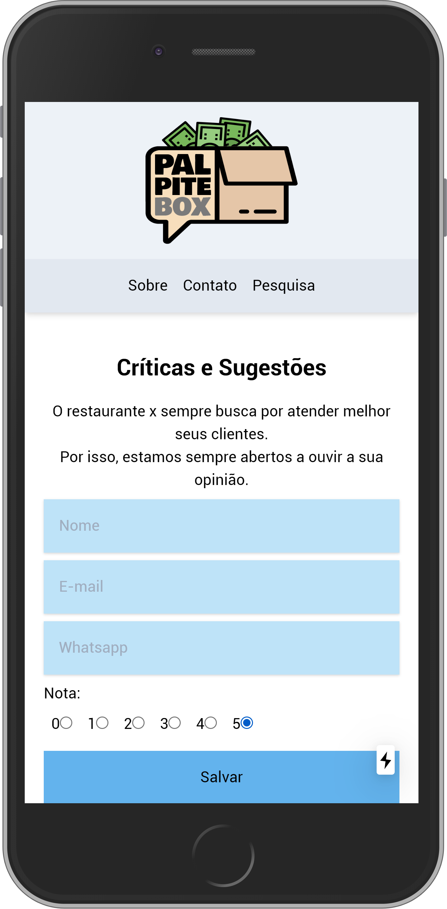

# Palpite Box
[](http://hits.dwyl.com/d4rwln/palpite-box)

Palpite Box é uma aplicação feita com NextJS na semana Fullstack Master da DevPleno




## Getting Started

Siga os passos abaixo para rodar esta aplicação direto na sua máquina.<br/>
1️⃣ Será necessário criar e configurar uma Planilha do Google<br/>
2️⃣ Cadastrar e configurar as variáves de ambiente com as infomações da [API do Google Spread](https://console.developers.google.com)<br/>
3️⃣ Mudar para Base64 a Primary key<br/>
4️⃣ Execuar os comandos:<br/>

```
npm install
npm run dev
```
 Olha o aquivo <strong>.env.example</strong> para saber quais variáveis é necessário mudar.


### Pré-requisitos

✅NodeJS <br/>
✅Npm <br/>
✅Conta do Google <br/>


## Construído com

* [NextJs](https://nextjs.org/) - The react framework.
* [TailwindCSS](https://tailwindcss.com/) - A utility-first CSS framework for rapidly building custom designs.
* [Google Spreadsheet](https://https://www.npmjs.com/package/google-spreadsheet/) - Database.


## Autores

* **Darwin Pinheiro** - [LinkedIn](https://www.linkedin.com/in//)

## License

Este projeto está sobre a licença MIT License - veja o arquivo [LICENSE.md](LICENSE.md) para mais detalhes.

## Agradecimentos

* Este projeto foi feito durante as aulas da Semana Fullstack Master da [Devpleno](https://devpleno.com).